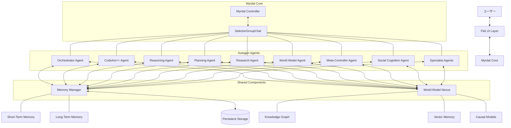

# Myrdal Implementation Plan Based on Autogen

## 1. 全体アーキテクチャ



> **注記**: MemoryManager/WorldModelNexusは**全Agentと直接接続**され、各Agentは必要な機能（myrdal_spec.mdの3〜16）を拡張として持つ。

## 2. 実装アーキテクチャ

Autogen v0.5.6の`SelectorGroupChat`をベースにして、myrdal_spec.mdで定義された17の核心機能を実装します。既存のAutogen機能を最大限に活用しつつ、必要に応じて拡張コンポーネントを追加します。

### 2.1 ディレクトリ構造

```
myrdal/
├── __init__.py
├── main.py                   # メインコントローラークラス
├── agents/                   # カスタムエージェント実装
│   ├── __init__.py
│   ├── base.py               # 基本エージェントクラス
│   ├── orchestrator.py       # オーケストレーターエージェント
│   ├── codeact.py            # CodeAct++エージェント
│   ├── reasoner.py           # 推論エージェント
│   ├── world_model.py        # 世界モデルエージェント
│   ├── meta_controller.py    # メタコントローラーエージェント
│   └── specialist.py         # 専門家エージェント
├── memory/                   # メモリ管理システム
│   ├── __init__.py
│   ├── manager.py            # メモリマネージャー
│   ├── short_term.py         # 短期記憶
│   ├── long_term.py          # 長期記憶
│   └── persistent.py         # 永続化機能
├── world_model/              # 世界モデルネクサス
│   ├── __init__.py
│   ├── nexus.py              # 統合世界モデル
│   ├── knowledge_graph.py    # 知識グラフ
│   ├── vector_store.py       # ベクトル記憶
│   └── causal_engine.py      # 因果推論エンジン
├── utils/                    # ユーティリティ
│   ├── __init__.py
│   ├── config.py             # 設定管理
│   └── logger.py             # ロギング
└── tools/                    # 特殊ツール
    ├── __init__.py
    ├── code_tools.py         # コード関連ツール
    └── research_tools.py     # 調査関連ツール
```

## 3. 主要コンポーネント詳細

### 3.1 Myrdal Core Controller

`myrdal/main.py`に実装される中央コントローラークラスは、UIとの連携を担当し、`SelectorGroupChat`と各サブシステムを管理します。

#### Agent拡張の設計方針
- 各Agentは`memory_manager`と`world_model_nexus`を必ず引数で受け取る。
- myrdal_spec.mdの3〜16の各機能（例：因果推論、抽象思考、長期記憶、メタ認知など）は、AgentのサブクラスやMixin、DI（依存性注入）で拡張する。
- 例：`ReasonerAgent`は`CausalReasoningMixin`や`AbstractThinkingMixin`を継承、`MetaControllerAgent`は`MetaCognitionMixin`を継承、など。

#### サンプル（抜粋）
```python
class MyrdalAgentBase:
    def __init__(self, memory_manager, world_model_nexus, **kwargs):
        self.memory_manager = memory_manager
        self.world_model_nexus = world_model_nexus
        # ...他の共通初期化

class CausalReasoningMixin:
    # myrdal_spec.mdの7を実装
    pass

class AbstractThinkingMixin:
    # myrdal_spec.mdの8を実装
    pass

class MetaCognitionMixin:
    # myrdal_spec.mdの10を実装
    pass

class ReasonerAgent(MyrdalAgentBase, CausalReasoningMixin, AbstractThinkingMixin):
    pass

class MetaControllerAgent(MyrdalAgentBase, MetaCognitionMixin):
    pass

# ...他のAgentも同様に必要なMixin/拡張を継承
```

#### SelectorGroupChatの初期化例
```python
from autogen_agentchat.teams import SelectorGroupChat
# ...Agentのimport

agents = [
    OrchestratorAgent(memory_manager, world_model_nexus, ...),
    CodeActAgent(memory_manager, world_model_nexus, ...),
    ReasonerAgent(memory_manager, world_model_nexus, ...),
    # ...他のAgent
]
team = SelectorGroupChat(
            agents=agents,
    selector_func=...,  # カスタム選択ロジック
    memory=memory_manager.get_group_chat_memory(),
)
```

### 3.2 Memory Manager (長期記憶保持システム)

- **役割**: 短期・長期記憶の統合管理、文脈検索、永続化
- **インターフェース例**:
  - `get_agent_memory(agent_id: str) -> Memory`
  - `get_group_chat_memory() -> Memory`
  - `store_message(message: dict) -> None`
  - `get_relevant_context(message: str) -> str`
- **全Agentが直接参照し、各Agentの知識・推論・記憶機能を強化する"共通サービス"**

### 3.3 World Model Nexus (統合世界モデルネクサス)

- **役割**: 多層知識表現、因果推論、時系列予測、メタ認知
- **インターフェース例**:
  - `update(message: str) -> None`
  - `query(query: str) -> str`
  - `get_knowledge_graph() -> Any`
- **全Agentが直接参照し、各Agentの知識・推論・記憶機能を強化する"共通サービス"**

### 3.4 Agent拡張（myrdal_spec.md 3〜16）

- myrdal_spec.mdの3〜16の各機能は、Agentの拡張（Mixin/サブクラス/DI）として実装し、必要なAgentに付与する
- 例：
  - `CausalReasoningMixin`（高度因果推論エンジン）
  - `AbstractThinkingMixin`（階層的抽象思考）
  - `LongTermMemoryMixin`（長期記憶保持）
  - `MetaCognitionMixin`（メタ認知）
  - ...など

### 3.5 SelectorGroupChatの活用

- `SelectorGroupChat`の`agents`リストに、Memory/WorldModelを組み込んだ拡張Agentを渡す
- `selector_func`で文脈・メタ認知・世界モデルを活用した発話者選択が可能
- `run_stream`でUI層と非同期ストリーム連携

---

## 4. まとめ

- **MemoryManager/WorldModelNexusは全Agentと直接接続**
- **myrdal_spec.mdの3〜16はAgentの拡張として実装**
- **アーキテクチャ図・実装例・説明を上記方針で修正**

これにより、Myrdalの仕様・要件（myrdal_spec.md）とAutogenの最新設計が矛盾なく統合されます。

## 5. 熟考型AI（CoT/ToT）と外部ツール連携の設計方針

- Myrdalのエージェントは、Chain-of-Thought（CoT）やTree-of-Thought（ToT）型の熟考ループをon_messages_streamで実装する。
- この熟考ループでは、AI自身が「納得するまで」何ステップでも自律的に思考・推論・知識モジュール（長期記憶・知識グラフ・因果推論・抽象思考・多言語理解など）を呼び出し続ける。
- 熟考ループ中は**外部ツール（WebブラウザやAPI等の外部インタラクト系）は一切呼び出さず**、内部知識モジュールのみを利用する。
- 各ステップで、LLMには英語でStructured Output（JSONやPydanticモデル等）を要求し、
  - "thought": 現在の思考
  - "call_module": 次に呼び出す知識モジュール（またはnull）
  - "satisfied": true/false（納得したかどうか）
  - "final_answer": 納得した場合の最終回答
 などを構造化して返させる。
- AIが"satisfied": trueとなりfinal_answerを出したタイミングでのみ、AssistantAgentの標準on_messages_streamのように**外部ツール呼び出し（Web検索・API等）を許可**する。
- これにより、「まず自分の知識・推論だけで考え抜き、どうしても必要な場合のみ外部リソースを使う」という人間らしい思考フローを実現する。
- UI側もストリーミングでAIの熟考・推論・知識活用の過程をリアルタイムで可視化できる。

---
