# Myrdal 統合仕様書

## 概要

Myrdalは、中国Monica社が開発した自律的汎用AIエージェント「Manus」を超える次世代AIエージェントシステムです。Manusの固定的なモデル重みや限られた自己改善能力、不十分な世界モデル統合などの課題を克服するために、独自実装の革新的なアーキテクチャを採用します。

本システムは以下の核心機能を統合し、自己進化的かつ安全性の高い自律汎用AIエージェントを実現します：

1. 動的マルチLLMオーケストレーション
2. Gödel的メタコントローラ
3. 統合世界モデルネクサス
4. 拡張版CodeAct++モジュール
5. 再帰的自己強化ループ（RSI）
6. 確率論的目標整合バリデータ
7. 高度因果推論エンジン
8. 階層的抽象思考メカニズム
9. 長期記憶保持システム
10. 統合メタ認知フレームワーク
11. マルチモーダル環境理解システム
12. 説明可能AIシステム統合
13. 社会的認知・調整システム
14. 自己構造化アーキテクチャ
15. 大規模知識統合アーキテクチャ
16. 多文化・多言語理解システム
17. Messengerマネージャー

**目標性能:** GAIAベンチマークでレベル1で95%以上、レベル3で90%以上の精度を達成

## 背景：Manusの現状と限界

Manusは中国のMonica（別名Butterfly Effect AI）社が開発した自律的汎用AIエージェントで、以下の特徴と限界を持ちます：

- **特徴**：
  - 外部の継続的な人手介入なしに複雑なオンラインタスクを遂行
  - AnthropicのClaudeシリーズやAlibabaのQwenを基盤モデルとして利用
  - Pythonコード実行による「CodeAct」アプローチで自律的行動を実現
  - GAIAベンチマークでレベル1で86.5%、レベル3でも57.7%の高精度

- **限界**：
  - モデルの学習済み重みが静的で、運用中に自己改良する仕組みが乏しい
  - 世界モデルの統合が浅く、長期計画や因果推論に脆弱
  - プライバシーやデータセキュリティへの懸念が強い

## システム設計：

- **グラフベースのワークフロー**: 直線的なチェーンではなくサイクルを含む複雑なエージェントフローを構築
- **状態管理**: 複雑な状態を保持し、エージェント間で共有するための仕組み
- **マルチアクターサポート**: 異なる役割を持つ複数のエージェントを協調させる機能
- **永続化機能**: 長期にわたる操作や人間とのインタラクションをサポート

## 核心機能の詳細実装

### 1. 動的マルチLLMオーケストレーション

専門化したLLM群を動的に呼び出し協調動作させる機構を実装します。

#### 設計思想
単一LLMではなく、目的別に最適化されたLLMを動的に選択して連携させることで、総合的な能力を向上させます。さらに、LLM間で自律的な協調と役割分担を行うことで、複雑なタスクでの優れた問題解決能力を発揮します。

各エージェント間の通信は構造化されたコンテキスト共有メカニズムを通じて行われ、重要情報の効率的な伝達と階層的な記憶管理が可能になります。また、各エージェントの得意分野は自動的に検出され、最適なタスク分配が行われます。

#### 高度化された設計
- **動的モデル選択**: タスクの複雑性と要件に応じて、最適なモデルの組み合わせを自動選択
- **コンテキスト共有メカニズム**: エージェント間で重要情報を効率的に共有する階層的メモリ構造
- **専門知識マッピング**: 各LLMの得意分野を自動検出し、最適なタスク分配を実現
- **協調学習機構**: エージェント間の相互フィードバックを通じた継続的な改善サイクル

### 2. Gödel的メタコントローラ

Gödel Machineに着想を得た自己記述的アルゴリズム改良・検証ループを実装し、システム自身が高次目標に基づいてコードや構成を動的に書き換えることを可能にします。

#### 設計思想
システムに自己参照的な改善能力を与えるには、自身のコードを分析・修正し、形式的な検証を行う能力が必要です。Gödel的メタコントローラは、事前に定義された「証明システム」によって改変の正当性を検証しながら、自己のアルゴリズムを継続的に改善する革新的なメカニズムです。

このコントローラは、システムの現在の状態とコード構造を継続的に監視・分析し、改善機会を特定します。特に重要なのは、このメタコントローラが単なる最適化だけでなく、アルゴリズムの本質的な改良や新機能の統合も行える点です。

#### 高度化された設計
- **形式的証明検証**: 自己改変の正当性を数学的に検証するシステム
- **メタ推論エンジン**: システム自身の動作や性能を分析し、改善策を導く
- **コード自己書き換え**: 安全性を保ちながら自身のコードを書き換える能力
- **段階的自己最適化**: 性能指標に基づいた段階的な自己改良戦略

### 3. 統合世界モデルネクサス

単なるRAG（Retrieval-Augmented Generation）を越え、マルチモーダル時系列予測と高度な因果モデルを備えた世界理解システムを実装します。

#### 設計思想
エージェントが真の自律性と理解力を持つには、情報検索だけでなく、外界の深い概念的理解と予測モデルが必要です。統合世界モデルネクサスは、単に事実を記憶するだけでなく、それらの関係性、時間的変化、因果構造を包括的に表現し、高度な推論と予測を可能にします。

このネクサスは、事実、概念、理論、信念からなる多層知識表現を採用し、知識を単なるフラットな情報の集合ではなく、深い階層構造として扱います。さらに、メタ認知層によって自らの知識の限界と不確実性を認識する能力を持ちます。

#### 高度化された設計
- **多層知識表現**: 事実、概念、理論、信念を階層的に構造化
- **自己更新機構**: 新情報に基づく自動的な知識構造更新
- **時空間モデリング**: 時間的文脈と空間的関係の明示的な表現
- **メタ認知層**: 自らの知識の限界と不確実性の認識

### 4. 拡張版CodeAct++モジュール

ManusのCodeActを進化させ、コード生成と実行だけでなく、生成コードの自己診断、最適化、安全性検証を行うモジュールを実装します。

#### 設計思想
高度なAIエージェントには、プログラミング能力が不可欠です。CodeAct++は単なるコード生成ではなく、生成したコードのパフォーマンス分析、自動デバッグ、最適化、セキュリティチェックなど、熟練プログラマのような総合的なコーディング能力を実現します。

このモジュールは、まずコード生成段階で複数の候補を並列生成し、それらを静的解析ツールで評価して最適な実装を選択します。マルチ言語サポートにより、タスクに最適なプログラミング言語を選択できるほか、コード間の翻訳能力も備えています。

#### 高度化された設計
- **コード品質分析**: 静的解析と実行時プロファイリングによる品質評価
- **自動リファクタリング**: パターン認識による最適なコード構造への変換
- **マルチ言語サポート**: 複数言語間のコード変換と最適化
- **安全性スキャナー**: セキュリティ脆弱性の自動検出と修正提案

### 5. 再帰的自己強化ループ（RSI）

システムが自らの能力を評価し、改善命題を設定して自己改良する再帰的プロセスを実装します。

#### 設計思想
真に進化するシステムには、外部からの訓練だけでなく自己改善能力が必要です。RSIループは、システムが自身の性能を客観的に評価し、改善領域を特定して、その能力を継続的に向上させるメカニズムを提供します。

このループは、システムの性能を多次元で評価するフェーズから始まります。精度、効率性、一般化能力、タスク多様性への対応など、様々な角度から性能を測定し、現在の限界を把握します。また、将来必要になると予測される機能を先行的に開発することも可能にします。

#### 高度化された設計
- **多次元性能評価**: 精度、効率性、一般化能力などの総合的評価
- **失敗モード分析**: 失敗パターンの体系的特定と改善戦略
- **機能拡張予測**: 将来必要となる機能の先行的開発
- **資源最適化学習**: 計算資源の効率的使用法の自己学習

### 6. 確率論的目標整合バリデータ

自己改変の安全性を確保するため、目標との整合性をベイズ推論で確率的に検証するシステムを実装します。

#### 設計思想
自己改善能力を持つシステムは、目標から逸脱するリスクがあります。確率論的目標整合バリデータは、システムの変更が元の目標と整合しているかを厳密に検証し、安全で信頼性の高い自己改善を保証します。

このバリデータは、多階層整合性分析により、システムの変更を様々な抽象レベルで検証します。また、人間価値アライメント機能は、システムの行動や判断が人間の意図や価値観と整合していることを確認します。

#### 高度化された設計
- **多階層整合性分析**: 様々な抽象レベルでの目標整合性検証
- **ベイズ証拠累積**: 整合性に関する証拠の確率的蓄積と更新
- **反実仮想テスト**: 「もし〜だったら」のシナリオに基づく安全性検証
- **人間価値アライメント**: 人間の意図や価値観との整合性確認

### 7. 高度因果推論エンジン

複雑な因果関係を推論し、長期的な影響を予測する革新的な因果推論エンジンを実装します。

#### 設計思想
GAIAレベル3のタスクを90%の精度で達成するには、抽象的な情報から強力な因果関係の推論能力が不可欠です。このモジュールは、構造化因果モデル（SCM）、ベイジアンネットワーク、反実仮想推論を統合し、複雑なシナリオでの因果関係を高精度に推論します。

因果推論エンジンは、入力データから因果的に関連する変数を識別し、それらの間の関係性を構造化して因果グラフを構築します。このグラフは単なる相関ではなく、「原因と結果」の関係を表現し、介入や政策決定のシミュレーションを可能にします。

#### 高度化された設計
- **因果モデル構築**: 複雑なデータから因果関係を抽出するアルゴリズム
- **反実仮想推論**: 「もし～だったら」の仮想シナリオのシミュレーション
- **介入効果予測**: 特定の介入が及ぼす影響の定量的推定
- **因果経路分析**: 原因から結果への影響経路の詳細な特定と分析

### 8. 階層的抽象思考メカニズム

レベル3の90%精度を達成するには、より高度な抽象思考能力が不可欠です。このモジュールにより、エージェントは複雑な問題を抽象化し、異なる抽象レベルで思考する能力を獲得します。

#### 設計思想
人間の認知能力の中核を担う抽象化能力をエミュレートし、具体的事例から一般原則を抽出したり、逆に抽象概念から具体的な応用を導いたりする能力を実装します。これにより、未知の問題に対してもパターン認識と推論を適用できるようになります。

階層的抽象思考メカニズムは、具体から抽象へ、そして抽象から具体へと双方向に移動できる認知プロセスを実現します。また、アナロジー生成機能により、異なるドメイン間の構造的類似性を認識し活用します。

#### 高度化された設計
- **概念階層構築**: 概念間の関連性と階層を自動的に構築・更新
- **アナロジー生成**: 異領域間の構造的類似性に基づく推論
- **抽象レベル移動**: 具体と抽象の間を自在に移動する思考能力
- **メタ認知制御**: 適切な抽象レベルを選択し思考を方向づける能力

### 9. 長期記憶保持システム

10年以上前の情報も含む長期記憶を保持し、適切に検索・活用できるシステムを実装します。

#### 設計思想
単なる情報の保存ではなく、人間の記憶システムを模倣した多層的かつ適応的な記憶アーキテクチャを構築します。時間の経過とともに記憶が変容し、文脈に応じて適切に想起される仕組みにより、より自然で効果的な知識活用を実現します。

このシステムは、一時的・作業記憶から超長期記憶まで、異なる時間スケールの情報を適切に管理します。また、記憶の統合・固定化プロセスにより、短期記憶から長期記憶への変換と既存知識との統合が自動的に行われます。

#### 高度化された設計
- **多層時間スケール記憶アーキテクチャ**: 作業記憶から超長期記憶までの階層構造
- **記憶統合・固定化メカニズム**: アイドル時に行われる記憶の整理と強化
- **コンテキスト依存検索**: 現在の状況に応じた最適な記憶想起
- **時間認識記憶マッピング**: 「いつ」の次元を明示的に扱う時間的コンテキスト管理
- **記憶変容・適応機構**: 新情報による記憶の自動更新と文脈適応
- **エピソード・セマンティック二重記憶**: 経験と抽象知識の区別と連携

### 10. 統合メタ認知フレームワーク

システム全体の思考プロセスを監視・制御し、自己認識と自己制御を可能にする高次認知システムを実装します。

#### 設計思想
高度な知的システムには、自らの認知プロセスを監視し、制御する能力が不可欠です。統合メタ認知フレームワークは、システムのあらゆる思考や判断プロセスを高次レベルで監視し、最適化するための枠組みを提供します。

このフレームワークにより、システムは自らの思考の強みと限界を認識し、状況に応じて最適な認知戦略を選択できるようになります。また、自己モニタリング機能により、誤りの早期検出と修正が可能になります。

#### 高度化された設計
- **認知戦略管理**: 状況に応じた最適な思考アプローチの選択
- **自己モニタリング**: 思考プロセスのリアルタイム監視と評価
- **エラー検出・修正**: 推論や判断の誤りを早期に発見し修正
- **認知資源最適化**: 限られた計算資源の効率的な配分
- **メタ学習**:認知プロセス自体の継続的改善

### 11. マルチモーダル環境理解システム

テキスト、画像、音声、空間データなどの多様なモダリティを統合して環境を理解するシステムを実装します。

#### 設計思想
真の汎用AIは、人間のように多様な感覚情報を統合して環境を理解する能力が必要です。マルチモーダル環境理解システムは、異なる種類の情報を相互補完的に処理し、より豊かで正確な環境モデルを構築します。

このシステムでは、各モダリティのデータを専用のエンコーダで処理し、それらを共通の表現空間に統合します。これにより、一つのモダリティの情報からその他のモダリティを推論したり、複数のモダリティにまたがる複合的なパターンを認識したりすることが可能になります。

#### 高度化された設計
- **クロスモーダル表現学習**: 異なるモダリティ間の関連性を捉える共通表現
- **マルチモーダル注意機構**: 状況に応じて重要なモダリティに注意を向ける機能
- **モーダル間推論**: 一つのモダリティから他のモダリティの状態を推論
- **統合知覚処理**: 複数モダリティからの情報を組み合わせた高次理解

### 12. 説明可能AIシステム統合

システムの判断や行動の理由を人間が理解できる形で説明する機能を実装します。

#### 設計思想
高度なAIシステムが社会に受け入れられ、効果的に活用されるためには、その判断プロセスが透明で説明可能であることが重要です。説明可能AIシステム統合は、複雑な内部処理を人間が理解できる形で説明する能力を提供します。

このシステムでは、推論の各ステップが明示的に追跡され、重要な判断ポイントと使用された情報がログ記録されます。また、ユーザーの知識レベルや関心に応じて、様々な抽象度や詳細度で説明を生成することができます。

#### 高度化された設計
- **判断過程の透明化**: 意思決定の各ステップを明示的に記録し可視化
- **適応的説明生成**: ユーザーの知識レベルに合わせた説明の調整
- **根拠付き応答**: すべての判断に対する根拠や証拠の提示
- **反実仮想説明**: 「もし～だったら」の説明による判断境界の明確化

### 13. 社会的認知・調整システム

他者との対話や協働における社会的・感情的側面を理解し、適切に対応する能力を実装します。

#### 設計思想
真に有用なAIエージェントには、単なる論理的・事実的な処理能力だけでなく、人間の社会的・感情的側面を理解し対応する能力が求められます。社会的認知・調整システムは、対話相手の感情状態、社会的文脈、関係性などを認識し、それに応じたコミュニケーションを行う能力を提供します。

このシステムでは、言語表現から感情や意図を検出する感情理解機能、相手の知識状態や信念を推測する心の理論モデル、そして社会的規範や礼儀作法に基づく対応生成機能が統合されています。

#### 高度化された設計
- **感情理解・共感**: 対話相手の感情状態の検出と適切な共感的応答
- **心の理論モデル**: 他者の信念・知識・意図の推測と予測
- **社会的文脈認識**: 社会的規範や期待に基づく適切な行動選択
- **関係構築・維持**: 長期的な信頼関係を構築・維持するための対話戦略

### 14. 自己構造化アーキテクチャ

システムが自らの内部構造を動的に再構成し、タスクや環境に最適に適応できるアーキテクチャを実装します。

#### 設計思想
固定的なアーキテクチャでは、様々な状況やタスクに最適に対応することが難しいという限界があります。自己構造化アーキテクチャは、システムが自らの内部構造、処理フロー、モジュール間の連携を動的に調整し、与えられた状況に最適な形に自己組織化する能力を提供します。

このアーキテクチャでは、モジュールやコンポーネントが固定的な階層構造を持つのではなく、タスクの要件に応じて柔軟に接続・構成されます。これにより、単一のアーキテクチャで様々なタイプの問題に効率的に対応することが可能になります。

#### 高度化された設計
- **動的モジュール構成**: タスクに応じたモジュールの動的組み合わせと構成
- **自己モニタリングと最適化**: システム性能の継続的モニタリングと構造最適化
- **創発的機能形成**: 基本コンポーネントの連携による高次機能の創発
- **適応的リソース配分**: 重要なタスクやモジュールへの計算リソースの優先割当

### 15. 大規模知識統合アーキテクチャ

多様なドメインの知識を統合し、分野横断的な推論や創造を可能にするシステムを実装します。

#### 設計思想
真の汎用AIには、多様な領域の知識を統合し、それらの間の関連性を理解する能力が必要です。大規模知識統合アーキテクチャは、専門分野ごとに分断された知識体系を統合し、分野横断的な推論や創造を可能にします。

このアーキテクチャでは、概念間の類似性や関連性に基づいて異なるドメインの知識が連結され、共通のフレームワークで表現されます。これにより、一つの分野で学んだ原則や方法を別の分野に転用したり、複数の分野の知識を組み合わせて新しい洞察を生み出したりすることが可能になります。

#### 高度化された設計
- **概念橋渡し機能**: 異なるドメイン間の概念的な橋渡しと対応付け
- **メタ知識表現**: 知識の性質や適用条件に関する高次知識
- **ドメイン適応推論**: ドメイン固有の制約を考慮した柔軟な推論
- **知識ギャップ検出**: 現存する知識の境界と不足を特定する機能

### 16. 多文化・多言語理解システム

異なる文化的背景や言語体系を理解し、適切にコミュニケーションする能力を実装します。

#### 設計思想
グローバル社会におけるAIシステムには、単一の文化や言語だけでなく、多様な文化的背景や言語体系を理解し対応する能力が求められます。多文化・多言語理解システムは、文化的文脈や言語的ニュアンスを考慮した理解と生成を可能にします。

このシステムでは、言語間の深い構造的対応関係を学習した多言語表現と、文化固有の概念や価値観を捉える文化モデルが統合されています。これにより、単なる翻訳を超えた文化的に適切なコミュニケーションが可能になります。

#### 高度化された設計
- **文化固有概念マッピング**: 文化に固有の概念や価値観の理解と対応付け
- **言語間深層対応**: 異なる言語間の構造的・意味的対応関係の学習
- **文化的背景考慮生成**: 文化的文脈を考慮したコンテンツ生成
- **多文化的視点統合**: 複数の文化的視点を統合した均衡のとれた理解

### 17. Messengerマネージャー

さまざまなメッセージングプラットフォームとの連携を管理し、ユーザーとの一貫したコミュニケーションを可能にするシステムを実装します。

#### 設計思想
AIエージェントがさまざまなコミュニケーションチャネルを通じてユーザーと対話するためには、多様なメッセージングプラットフォームとの連携を効率的に管理する機能が必要です。Messengerマネージャーは、これらの連携を一元管理し、プラットフォームの違いを抽象化して一貫したユーザー体験を提供します。

このシステムは統合メタ認知フレームワークやその他の高度コンポーネントと連携し、メッセージング機能を通じてエージェントの高度な認知能力が最大限に発揮されるようにします。これにより、単なるメッセージの送受信ではなく、文脈を理解した知的な対話が可能になります。

#### 高度化された設計
- **プラットフォーム抽象化**: 異なるメッセージングプラットフォームの統一インターフェース
- **コンテキスト保持**: 複数のセッションやプラットフォームにまたがる文脈の維持
- **適応的応答生成**: プラットフォームの特性や制約に合わせた応答の最適化
- **セキュリティと認証管理**: 安全な通信と適切なアクセス制御の実現

## ユーザーワークフロー

Myrdalは優秀な対話パートナーのように振る舞い、以下のワークフローを提供します：
1. チャット開始: ユーザーは自然言語でMyrdalにタスクを依頼します。
2. コンテキスト理解: Myrdalは会話履歴とユーザーの意図を継続的に把握します。
3. 追加情報の統合: ユーザーが途中で情報を追加・修正してもリアルタイムに反映します。
4. サイドタスクの記憶: 別の話題を挟んでも、後で元のタスクに自動的に再開します。
5. 記憶と実行: 会話中に指示されたタスクを記憶し、適切なタイミングで実行または提案します。
6. 確認と承認: 重要な変更や実行内容は確認のうえ承認を得て進行します。
7. 柔軟な応答: ユーザーのスキルレベルや表現に応じて説明の深度・形式を調整します。
8. 終了とフォローアップ: タスク完了後は実行結果を報告し、次のステップや関連タスクを提案します。

このワークフローにより、Myrdalはユーザーと自然かつ生産的な対話を実現します。

### 18. Model Context Protocol (MCP) 統合

ユーザーは `mcp.json` に任意のMCPサーバーを登録し、MyrdalがMCPクライアントとして可用な外部操作を動的に呼び出せるようになります。

#### MCP構成ファイル例（典型フォーマット）
```json
{
  "mcpServers": {
    "filesystem": {
      "command": "npx",
      "args": [
        "-y",
        "@modelcontextprotocol/server-filesystem",
        "/Users/username/Desktop",
        "/path/to/other/allowed/dir"
      ],
      "env": {
        "LOG_LEVEL": "info",
        "PORT": "8080"
      }
    }
  }
}
```  
※ `mcpServers` 配下にサーバー名をキーにして、起動コマンド・引数・環境変数を定義できます。

#### 運用例
- Web検索: `search` capability を呼び出し、最新情報を取得
- コマンド実行: `exec` capability を呼び出し、シェルコマンドを実行
- ブラウザ操作: `browse` capability でUI操作やスクレイピング
- ファイルシステム操作: `fs` capability でファイル読み書き・管理

### 19. コンポーネント構造図

```mermaid
flowchart TD
  subgraph Config
    MC[mcp.json] & LC[llm_config.yaml]
  end
  subgraph Core
    CE[Myrdal Core Engine]
    LO[LLM Orchestrator]
    MCtl[Meta-Controller]
    WM[World Model Nexus]
    CA[CodeAct++]
    RS[RSI Loop]
    VAL[Validator]
    CE2[Causal Engine]
    AM[Abstract Mechanism]
    MM[Memory Module]
    META[Meta-Cognition]
    MMU[Multi-Modal Understanding]
    XAI[Explainable AI]
    SOC[Social Cognition]
    SA[Self-Struct Architecture]
    KI[Knowledge Integrator]
    ML[Multi-Lingual]
    MSG[Messenger Manager]
  end
  subgraph MCP
    MCPClient[MCP Client]
    OPS[Operation Modules]
    WS[Web Search]
    EX[Command Exec]
    BR[Browser Ctrl]
    FS[FileSystem]
  end
  MC --> MCPClient
  MCPClient --> WS
  MCPClient --> EX
  MCPClient --> BR
  MCPClient --> FS
  CE --> LO
  CE --> MCtl
  CE --> WM
  CE --> CA
  CE --> RS
  CE --> VAL
  CE --> CE2
  CE --> AM
  CE --> MM
  CE --> META
  CE --> MMU
  CE --> XAI
  CE --> SOC
  CE --> SA
  CE --> KI
  CE --> ML
  CE --> MSG
  CE --> MCPClient
```


## 評価計画と目標

### GAIAベンチマーク目標
- **レベル1**: 95%以上の精度
- **レベル3**: 90%以上の精度

### 長期記憶評価
- **超長期記憶保持率**: 10年前の情報に対して80%以上の正確性
- **検索精度**: 複雑な文脈依存クエリでP@10 > 0.9

### 創造的問題解決能力
- **未知問題解決率**: 訓練データに含まれない問題の解決率 > 85%
- **創造的アイデア生成**: 新規かつ有効な解決策の生成率 > 70%

### 社会的相互作用評価
- **感情理解精度**: 対話相手の感情状態検出精度 > 90%
- **適応的コミュニケーション**: 社会的文脈に応じた適切な応答生成率 > 85%

## 結論

Myrdalは、17の高度な核心機能を統合した次世代AIエージェントシステムとして、Manusの限界を超え、より自律的で適応性が高く、安全性の確保された汎用AIエージェントを実現します。独自実装の革新的なアーキテクチャにより、GAIAベンチマークでの高精度達成を目指すとともに、真の自己進化能力と長期記憶保持を備えたシステムを構築します。

 コアエージェント中心の統合アーキテクチャにより、すべてのコンポーネントの能力が最大限に活用され、ユーザーにとって一貫性があり、知的で、多機能なAIアシスタント体験を提供します。この統合的アプローチにより、Myrdalは「優秀な助っ人」としての役割を果たし、多様な問題解決と知的支援を可能にします。

